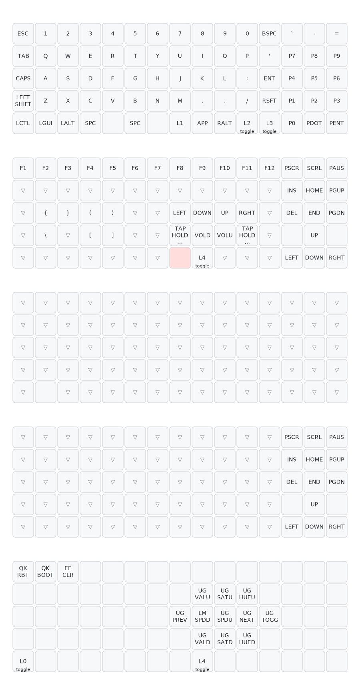

# XD75Re Keyboard Overview
This build combines a heavy linear switch feel with a clean Cherry profile keycap set. The XD75re’s ortholinear layout provides a large, flexible canvas for custom keymaps, making it well suited for gaming and workflow‑specific layouts.

# Hardware

| Product   | Manufacturer | Item                     |
|-----------|--------------|---------------------------|
| Keyboard  | KPrepublic   | XD75re                   |
| Switches  | Cherry       | MX Black                 |
|           | Cherry       | MX Speed Silver          |
| Keycaps   | Cherry       | CHERRY MX‑Board 3.0      |
|           | AKKO         | Macaw Cherry Profile     |

# Keymap

This keymap is designed to use the full keyboard efficiently for gaming while keeping navigation, media, and system controls accessible without disrupting gameplay. The layout uses five layers:

- Layer 0: Base typing layer
- Layer 1: Function, navigation, and media
- Layer 2: WinLock transparent layer
- Layer 3: Numpad navigation layer
- Layer 4: RGB and system utilities

## Layer 0: Base Layer

The primary typing layer includes:

- Full alphanumeric layout
- Number row and punctuation
- A dedicated numpad cluster on the right side
- Split spacebar with two blockers for stability
- Standard modifiers on both sides
- Layer access keys:
  - `MO(1)` for momentary access to Layer 1
  - `TG(2)` to toggle Layer 2
  - `TG(3)` to toggle Layer 3

This layer is designed for everyday use without requiring layer switching for numbers or navigation.

## Layer 1: Function, Navigation, and Media

Accessed via `MO(1)` from the base layer.

This layer provides:

- Function keys F1 to F12
- Print Screen, Scroll Lock, Pause
- Insert, Home, End, Page Up, Page Down
- Arrow keys
- Brackets and navigation symbols
- Media controls: volume, previous, next
- Two custom tap‑hold media keys:
  - `TAP_HOLD_MUTE_PREV`
  - `TAP_HOLD_PLAY_NEXT`

These tap‑hold keys allow single‑tap media actions while supporting hold behaviour for additional functionality.

This layer also provides access to the system layer (Layer 4).

## Layer 2: WinLock Layer

Layer 2 is a transparent layer used to block the Windows key when toggled.
It can be enabled with `TG(2)`.

This is useful for gaming sessions where accidental Windows key presses would be disruptive.

## Layer 3: Numpad Navigation Layer

Layer 3 transforms the numpad cluster into navigation keys, matching the layout shown on Layer 1.
It can be toggled with `TG(3)`.

This provides an alternate navigation profile without losing the dedicated numpad on the base layer.

## Layer 4: RGB and System Utilities

This layer contains system‑level and RGB controls, including:

- `QK_RBT` for soft reset
- `QK_BOOT` for bootloader
- `EE_CLR` for EEPROM clear
- RGB controls for brightness, saturation, hue, speed, mode switching, and toggling
- `TO(0)` to return to the base layer
- `TG(4)` to toggle this layer

This layer is intentionally isolated to prevent accidental activation of destructive commands.

# Firmware Features

In addition to the keymap layers, this firmware includes several custom behaviours implemented in `keymap.c`. These features extend QMK’s default functionality and provide more control over media keys, RGB underglow, and system‑level actions.

## Tap‑Hold Media Keys

Two custom keys provide dual‑function media behaviour based on tap duration:

- `TAP_HOLD_PLAY_NEXT`
  - Tap: Play/Pause
  - Hold: Next Track

- `TAP_HOLD_MUTE_PREV`
  - Tap: Mute
  - Hold: Previous Track

Both keys use a 200 ms threshold to determine whether the action is a tap or a hold. This allows quick access to common media controls without dedicating extra keys.

## System Layer RGB Override

When entering the System layer (Layer 4), the keyboard automatically switches the underglow to a dedicated colour:

- Hue: 43
- Saturation: 255
- Value: 256

This colour is applied immediately upon activating the layer. While in the System layer, any RGB adjustments (brightness, saturation, hue, speed, mode) are tracked. If the user changes the RGB settings while on this layer, those changes become the new saved base colour.

When leaving the System layer:

- If no RGB changes were made, the original colour is restored.
- If changes were made, the new colour becomes the persistent base colour.

This ensures that the System layer always has a distinct visual identity while still allowing intentional RGB adjustments to persist.

## Reset Colour Indicator

Before triggering a reboot or entering the bootloader (`QK_RBT` or `QK_BOOT`), the firmware sets the RGB underglow to red. This provides a clear visual confirmation that a reset is about to occur.

## WinLock Layer Behaviour

Layer 2 blocks the Windows key by overriding it with `KC_NO`.
This prevents accidental interruptions during gaming.

## Numpad Navigation Layer Behaviour

Layer 3 transforms the numpad cluster into navigation keys (arrows, Home, End, Page Up, Page Down).
This mirrors the navigation layout available on Layer 1 but allows it to be toggled persistently.